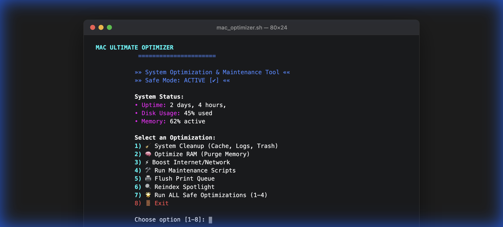

# 🚀 Mac Ultimate Optimizer - Elite Edition


> **The all-in-one terminal utility to keep your Mac running fast, clean, and smooth.**

---

## 🌟 Overview

**Mac Ultimate Optimizer** is a powerful, menu-driven Bash script designed to safely optimize your macOS experience. Whether you need to free up disk space, purge inactive RAM, or boost your network settings for lower latency, this tool handles it all with a sleek, user-friendly CLI interface.

It includes safety checks, live system status monitoring, and visual feedback (spinners & emojis) to ensure you know exactly what's happening under the hood.

## ✨ Features

| Feature | Description |
|---------|-------------|
| **🧹 System Cleanup** | Safely clears User Caches, System Logs, Trash, and Xcode DerivedData to reclaim GBs of space. |
| **🧠 RAM Optimizer** | Purges inactive memory to speed up a sluggish system without restarting. |
| **⚡ Network Booster** | Optimizes TCP/IP settings, flushes DNS, resets interfaces, and disables WiFi power saving for better connectivity. |
| **🛠 Maintenance** | Manually triggers macOS's built-in daily, weekly, and monthly maintenance scripts. |
| **🖨 Fix Printers** | Instantly flushes the print queue to clear stuck jobs. |
| **🔍 Spotlight Fix** | Rebuilds the Spotlight index if your search is broken or missing files. |
| **🛡 Safe Mode** | Includes warnings and confirmations for sensitive operations to prevent accidental data loss. |

## 📸 Preview



## 🚀 Installation & Usage

### 1. Clone the Repository
```bash
git clone https://github.com/instax-dutta/mac-optimiser.git
cd mac-optimiser
```

### 2. Make Executable
Give the script permission to run:
```bash
chmod +x mac_optimizer.sh
```

### 3. Run the Script
Since this script modifies system settings and clears system logs, it requires `sudo` privileges:
```bash
sudo ./mac_optimizer.sh
```

## ⚠️ Safety & Disclaimer

This script is designed to be **safe** and only deletes temporary files (Caches, Logs, Trash). It does **NOT** touch your personal documents, photos, or applications.

However, as with any system tool:
*   **Review the code** if you are unsure.
*   **Close important apps** before running the "System Cleanup" to avoid potential crashes (the script warns you about this).
*   **Use at your own risk.** The author is not responsible for any issues that may arise.

## 🤝 Contributing

Contributions are welcome! If you have a cool idea for a new optimization or a UI improvement:
1.  Fork the Project
2.  Create your Feature Branch (`git checkout -b feature/AmazingFeature`)
3.  Commit your Changes (`git commit -m 'Add some AmazingFeature'`)
4.  Push to the Branch (`git push origin feature/AmazingFeature`)
5.  Open a Pull Request

## 📝 License

Distributed under the MIT License. See `LICENSE` for more information.

---

<div align="center">
  Made with ❤️ by <a href="https://github.com/instax-dutta">instax-dutta</a>
</div>
